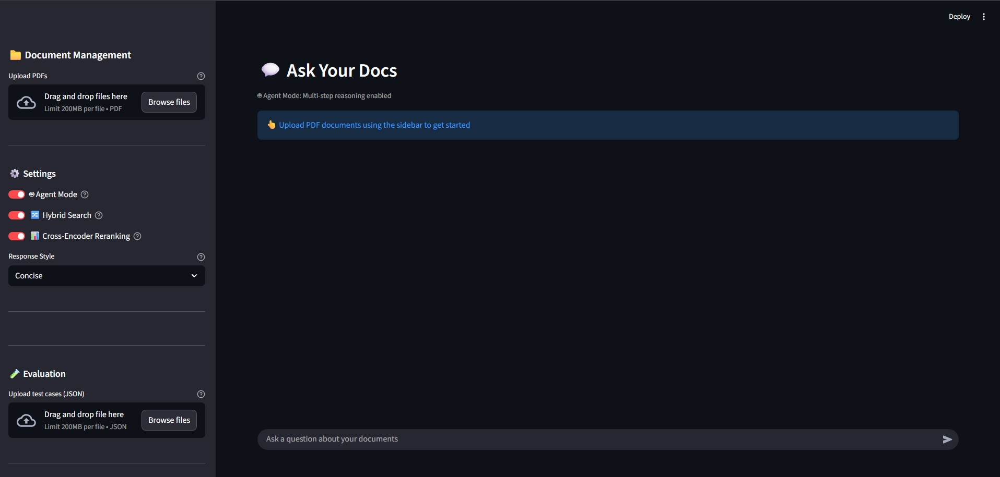
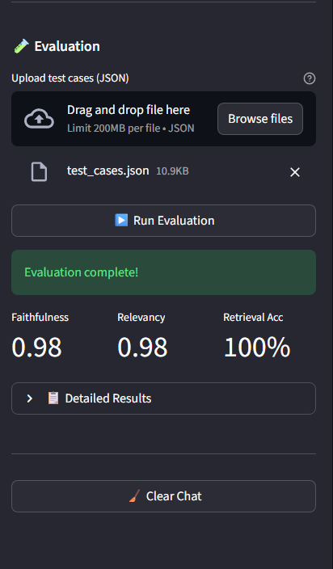
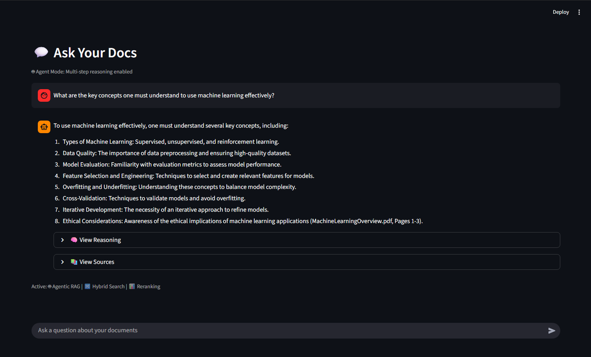

# Ask Your Docs - Agentic RAG 🤖📄

**Ask Your Docs** is an advanced Retrieval-Augmented Generation (RAG) application that transforms how you interact with your PDF documents. Built with **Streamlit**, **LangChain**, and **ChromaDB**, it goes beyond simple semantic search by incorporating **Hybrid Retrieval** (Keyword + Semantic), **Cross-Encoder Reranking**, and an **Agentic Mode** for multi-step reasoning.

<p align="center">
  
   
  
  
</p>

## 🚀 Project Overview

Standard RAG systems often fail when questions require combining information from multiple parts of a document or when exact keyword matching is crucial. This project solves these limitations by implementing a robust pipeline:

1.  **Ingestion:** PDFs are processed, chunked, and indexed.
2.  **Hybrid Retrieval:** Combines **BM25** (for exact keywords) and **Vector Search** (for semantic meaning) to find the best candidates.
3.  **Reranking:** Uses a Cross-Encoder model to re-score and re-order retrieved chunks, ensuring high precision.
4.  **Generation:**
    *   **Standard Mode:** Generates a direct answer using the retrieved context.
    *   **Agent Mode:** Uses an intelligent agent to break down complex questions, perform iterative searches, and reason through the answer.

## ✨ Key Features

*   **📄 Multi-Document Support:** Upload and chat with multiple PDF documents simultaneously.
*   **🧠 Agentic RAG:** Enable "Agent Mode" to handle complex, multi-hop queries that require reasoning.
*   **🔀 Hybrid Search:** Seamlessly blends keyword search (BM25) with semantic vector search (ChromaDB).
*   **📊 Smart Reranking:** Utilizes `sentence-transformers` cross-encoders to filter noise and surface the most relevant context.
*   **💬 Interactive Chat:** User-friendly Streamlit interface with chat history, source citations, and page references.
*   **🧪 Built-in Evaluation:** Integrated tool to upload JSON test cases and evaluate the pipeline's Faithfulness and Relevancy.
*   **💡 Auto-Suggestions:** Automatically generates suggested questions based on the uploaded content.

## 🛠️ Installation

Prerequisites: Python 3.10+

1.  **Clone the repository:**
    ```bash
    git clone https://github.com/yourusername/doc-rag-project.git
    cd doc-rag-project
    ```

2.  **Create a virtual environment:**
    ```bash
    python -m venv venv
    
    # Windows
    venv\Scripts\activate
    
    # Mac/Linux
    source venv/bin/activate
    ```

3.  **Install dependencies:**
    ```bash
    pip install -r requirements.txt
    ```

4.  **Configure Environment:**
    Copy the example environment file and add your OpenAI API key.
    ```bash
    cp .env.example .env
    ```
    Open `.env` and set your key:
    ```env
    OPENAI_API_KEY=sk-your-api-key-here
    ```

## 🖥️ Usage

1.  **Start the application:**
    ```bash
    streamlit run app.py
    ```

2.  **Using the App:**
    *   **Upload:** Use the sidebar to upload one or more PDF files.
    *   **Configure:** Toggle "Agent Mode", "Hybrid Search", or "Reranking" in the settings.
    *   **Chat:** Type your question in the chat input.
    *   **Inspect:** Expand "View Sources" or "Agent Reasoning" (in Agent Mode) to see how the answer was derived.

3.  **Evaluation (Optional):**
    The app includes a built-in evaluation framework to test the accuracy of the RAG pipeline using the "LLM-as-Judge" method.

    *   **Prepare Test Cases:** We provide two template formats in the repository:
        *   `test_cases_template_1.json`: Simple format using `question` and `expected_answer`.
        *   `test_cases_template_2.json`: Advanced format using `id`, `input`, `expected_output`, and `description`.
    *   **Run Test:**
        1.  Navigate to the **Evaluation** section in the sidebar.
        2.  Upload one of the template files (or your own custom JSON).
        3.  Click **Run Evaluation**.
    *   **Analyze:** The system will generate Faithfulness and Relevancy scores for each question and display a detailed report.

## 🤝 Contributing

Contributions are welcome! Please follow these steps:

1.  Fork the repository.
2.  Create a new branch (`git checkout -b feature/YourFeature`).
3.  Commit your changes (`git commit -m 'Add some feature'`).
4.  Push to the branch (`git push origin feature/YourFeature`).
5.  Open a Pull Request.

## 📄 License

This project is licensed under the MIT License - see the [LICENSE](LICENSE) file for details.
